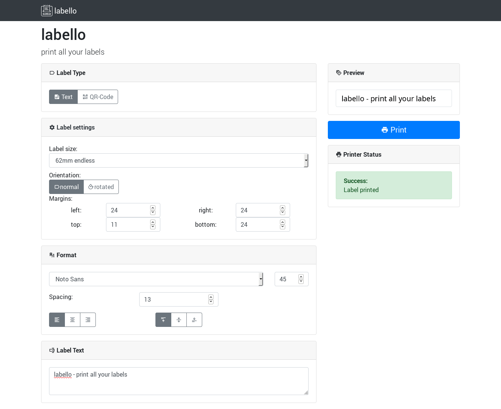

# labello - print all your labels

Labello is a webbased frontend for Brother QL* label printers

## Screenshot

## Installation

### Docker

The easiest way to setup labello is via docker. 
A docker container is available at the [Docker Hub](https://hub.docker.com/r/telegnom/labello)

1. Pull the latest version: `docker pull telegnom/labello:latest`
1. Run the container: `docker run -d -e 4242:4242 -v /path/to/your/font-folder:/opt/labello/fonts telegnom/labello`

## Configuration

There are some settings to alter the behavior and appearance of labello. In case of using docker the following environment variables can be set: 

| parameter | default value | description |
| --- | --- | --- |
| LAB_PRINTER_MODEL | QL-720NW | Model of your printer * |
| LAB_PRINTER_DEVICE | tcp://127.0.0.1:9100 | path of your printer - either tcp:// address or path to device e.g. /dev/usb/lp0 |
| LAB_FONT_PATH | /opt/labello/fonts | path where labello can find the fonts to use |
| LAB_SERVER_PORT | 4242 | Port on which the service listens |
| LAB_SERVER_HOST | 0.0.0.0 | IP on which the service listens |
| LAB_LOGGING | 30 | Log-Level: 10: debug, 20: info, 30: warning, 40: error, 50: critical |
| LAB_WEBSITE_HTML_TITLE | labello - print all your labels | HTML \<title\> |
| LAB_WEBSITE_TITLE | labello | main title in website |
| LAB_WEBSITE_SLUG | print all your labels | Slogan below title |
| LAB_WEBSITE_BOOTSTRAP_LOCAL | true | load bootstrap from local server (true) or from cdn (false) |
| LAB_LABEL_MARGIN_TOP | 24 | label top margin |
| LAB_LABEL_MARGIN_BOTTOM | 24 | label bottom margin |
| LAB_LABEL_MARGIN_LEFT | 24 | label left margin |
| LAB_LABEL_MARGIN_RIGHT | 24 | label right margin |
| LAB_LABEL_FEED_MARGIN | 10 | feed adjustment for precut labels - should not exceed 16 |
| LAB_LABEL_FONT_SPACING | 13 | vertical spacing between text lines |

\* Supported devices can be found in the [corresponding section of this document](#Supported printers) (below).

## Supported printers

* QL-500
* QL-550
* QL-560
* QL-570
* QL-580N
* QL-650TD
* QL-700
* QL-710W 
* QL-720NW 
* QL-800
* QL-810W
* QL-820NWB 
* QL-1050 
* QL-1060N

